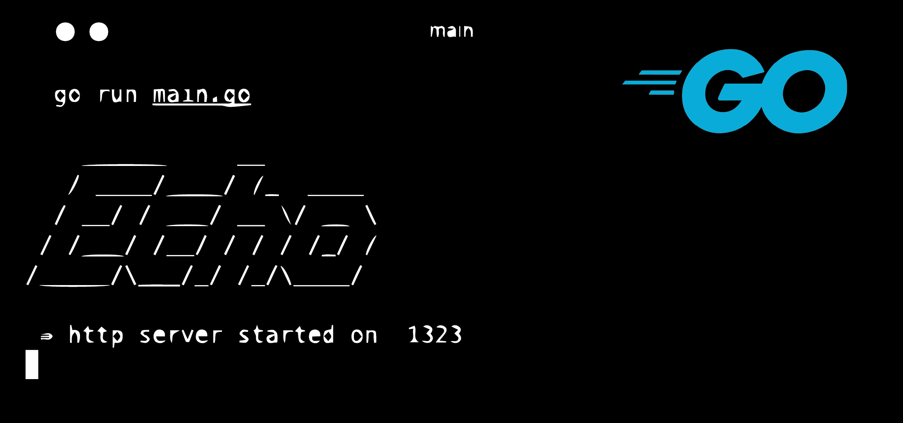

# Ecommerce App using Echo

We intend to develop an e-commerce application with a REST
architecture using the Echo framework. Echo is a Go web framework
known for its exceptional performance, extensibility, and
minimalistic design.

## Prerequisites

Before starting up this project, make sure you have the necessary dependencies installed in your machine.

### Software Installation

- [x] [Go](https://go.dev/) - Go is an open source programming language that makes it simple to build secure, scalable systems.

- [x] [Docker](https://www.docker.com/) - Docker helps developers bring their ideas to life by conquering the complexity of app development.

- [x] [PostgreSQL](https://www.postgresql.org/) - The World's Most Advanced Open Source Relational Database

# Database Schema

