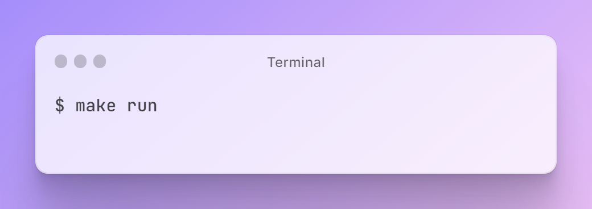

# Ecommerce App using Echo

We intend to develop an e-commerce application with a REST
architecture using the Echo framework. Echo is a Go web framework
known for its exceptional performance, extensibility, and
minimalistic design.


### Prerequisites

Before starting up this project, make sure you have the necessary dependencies installed in your machine.

### Software Installation

- [x] [Go](https://go.dev/) - Go is an open source programming language that makes it simple to build secure, scalable systems.

- [x] [Docker](https://www.docker.com/) - Docker helps developers bring their ideas to life by conquering the complexity of app development.

- [x] [PostgreSQL](https://www.postgresql.org/) - The World's Most Advanced Open Source Relational Database

- [x] [golangci-lint](https://golangci-lint.run/) - is a fast Go linters runner. It runs linters in parallel, uses caching, supports yaml config, etc.  


For running Postgres locally using Docker, run the following command: 

```bash
docker run --name ecommerce-local-db -p 5432:5432 -e POSTGRES_PASSWORD=******** -d postgres
```
### Database Schema


### Environment Variables

Before launching the application, be certain to configure the necessary environment variables.

```
- JWT_SECRET
- DB_HOST
- DB_USERNAME
- DB_PASSWORD
- DB_NAME
- DB_PORT
```
Using **Windows**? Run the following command


### Application Startup

#### Running App

```bash
make run
```


#### Building App

```bash
make build
```


#### Executing Tests

```bash
make test
```


#### Docker

Image is available in DockerHub https://hub.docker.com/repository/docker/mukulmantosh/go-ecommerce-echo/general
TODO: make it public

